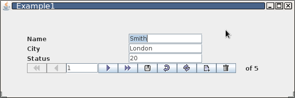
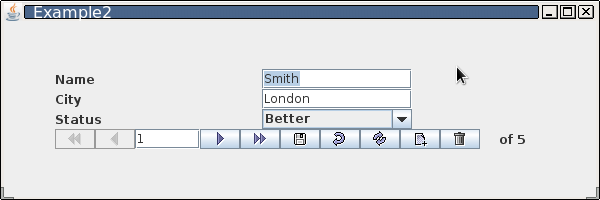
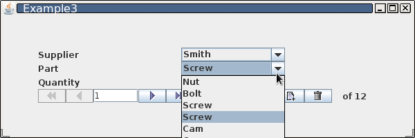
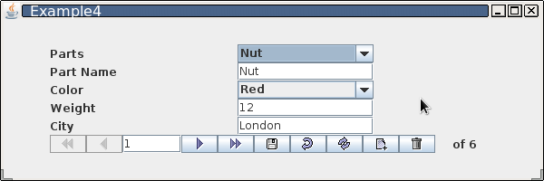
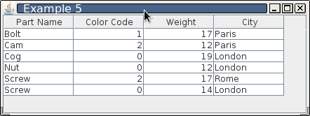

### (documentation in progress)
# Seesaw database aware components

[javadoc](https://visdb-dev.github.io/seesaw/).

## DESCRIPTION

Seesaw is an open source Java toolkit containing data-aware replacements for many of the standard Java Swing components.

The Seesaw feature-set currently includes:

1. data-aware replacements for JTextField, JTextArea, JComboBox, JCheckBox, JLabel, JSlider, & JFormattedTextField
2. binding of a "hidden" numeric column for combo boxes with text choices
   (e.g., 0, 1, & 2 are stored for "Yes," "No," & "Maybe," respectively)
3. population of combo boxes based on columns in a database query (can also be used for combo box-based record navigation)
4. a data-aware image component with image support
5. a graphical record navigator
    (a) allows for database traversal, insertion, deletion, commit, and rollback
    (b) supplies current record index (editable) and total record count
6. a data grid component for creating datasheet/spreadsheet/table views of queries
    (a) allows cut & paste to/from spreadsheet programs or other data grids
    (b) allows custom column headings
    (c) allows hiding of specified columns
    (d) allows disabling of specified columns
    (e) allows columns to be displayed as text boxes or combo boxes
    (f) allows addition and deletion of records
    (g) allows deletion of multiple, non-consecutive records
    (h) allows data entry "masks" to be applied to text columns
7. formatted fields for various types like currency, percent, SSN, date etc.

<!--
More information on SwingSet is available from:
https://github.com/bpangburn/swingset

visdb#NO-SPAM#@visdb.dev
-->
For questions regarding Seesaw, contact info at
[visdb-dev](https://github.com/visdb-dev)

## SCREENSHOTS

<!--
    Standard Markdown doesn't let you resize/restrict image dimensions.
    If your PNG is massive, use an HTML  tag to constrain it: 

    
-->

### Seesaw Demo - Example 1

### Seesaw Demo - Example 2

### Seesaw Demo - Example 3

### Seesaw Demo - Example 4

### Seesaw Demo - Example 5

